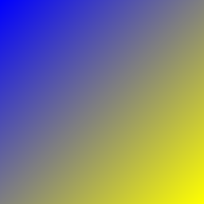
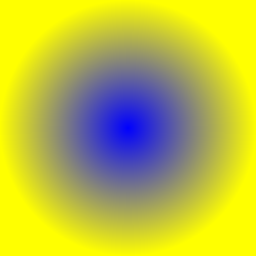
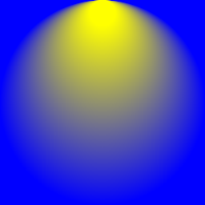
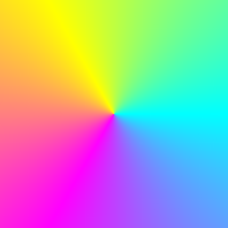
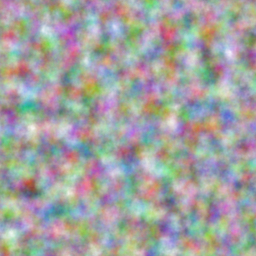
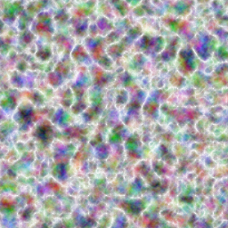
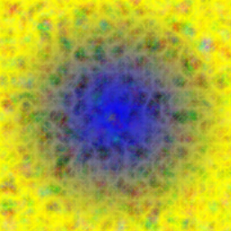

Below is the list of available shaders.
You can also [create your own shader](runtime-effects).

## Image

Returns an image as a shader with the specified tiling.
It will use cubic sampling.

| Name       | Type           |  Description                       |
|:-----------|:---------------|:-----------------------------------|
| source      | `ReturnType<typeof require>` | Source of the image |
| tx?         | `TileMode`   | Can be `clamp`, `repeat`, `mirror`, or `decal`. |
| ty?         | `TileMode`   | Can be `clamp`, `repeat`, `mirror`, or `decal`. |
| fm?         | `FilterMode` | Can be `linear` or `nearest`. |
| mm?         | `MipmapMode` | Can be `none`, `linear` or `nearest`. |
| fit?        | `Fit` | Calculate the transformation matrix to fit the rectangle defined by `fitRect`. See [images](images). |
| fitRect     | `IRect` | The destination reactangle to calculate the transformation matrix via the `fit` property. |
| transform?  | `Transforms2d` | see [transformations](transformations). |

### Example
```tsx twoslash
import React from "react";
import {
  Canvas,
  Paint,
  Circle,
  ImageShader,
  Skia,
  Shader,
} from "@shopify/react-native-skia";

export const ImageShaderDemo = () => {
  return (
    <Canvas style={{ flex: 1 }}>
      <Paint>
        <ImageShader
          source={require("../../assets/oslo.jpg")}
          fit="cover"
          fitRect={{ x: 0, y: 0, width: 256, height: 256 }}
        />
      </Paint>
      <Circle cx={128} cy={128} r={128} />
    </Canvas>
  );
};
```
### Result


## Linear Gradient

Returns a shader that generates a linear gradient between the two specified points.

| Name       | Type           |  Description                    |
|:-----------|:---------------|:--------------------------------|
| start      | `Point`        | Start position of the gradient. |
| end        | `Point`        | End position of the gradient.   |
| colors     | `string[]`     | Colors to be distributed between start and end. |
| positions? | `number[]`     | The relative positions of colors. If supplied must be same length as colors. |
| mode?      | `TileMode`     | Can be `clamp`, `repeat`, `mirror`, or `decal`. |
| flags?     | `number`       | By default gradients will interpolate their colors in unpremul space and then premultiply each of the results. By setting this to 1, the gradients will premultiply their colors first, and then interpolate between them. |
| transform? | `Transforms2d` | see [transformations](transformations). |

### Example
```tsx twoslash
import React from "react";
import {
  Canvas,
  Paint,
  Rect,
  LinearGradient,
  Skia,
  Shader,
  vec
} from "@shopify/react-native-skia";

export const LinearGradientDemo = () => {
  return (
    <Canvas style={{ flex: 1 }}>
      <Paint>
        <LinearGradient
          start={vec(0, 0)}
          end={vec(256, 256)}
          colors={["blue", "yellow"]}
        />
      </Paint>
      <Rect x={0} y={0} width={256} height={256} />
    </Canvas>
  );
};
```
### Result


## Radial Gradient

Returns a shader that generates a radial gradient given the center and radius.

| Name       | Type           |  Description                    |
|:-----------|:---------------|:--------------------------------|
| c          | `Point`        | Center of the gradient. |
| r          | `number`       | Radius of the gradient.   |
| colors     | `string[]`     | Colors to be distributed between start and end. |
| positions? | `number[]`     | The relative positions of colors. If supplied must be same length as colors. |
| mode?      | `TileMode`     | Can be `clamp`, `repeat`, `mirror`, or `decal`. |
| flags?     | `number`       | By default gradients will interpolate their colors in unpremul space and then premultiply each of the results. By setting this to 1, the gradients will premultiply their colors first, and then interpolate between them. |
| transform? | `Transforms2d` | see [transformations](transformations). |

### Example
```tsx twoslash
import React from "react";
import {
  Canvas,
  Paint,
  Rect,
  RadialGradient,
  Skia,
  Shader,
  vec
} from "@shopify/react-native-skia";

export const RadialGradientDemo = () => {
  return (
    <Canvas style={{ flex: 1 }}>
      <Paint>
        <RadialGradient
          c={vec(128, 128)}
          r={128}
          colors={["blue", "yellow"]}
        />
      </Paint>
      <Rect x={0} y={0} width={256} height={256} />
    </Canvas>
  );
};
```
### Result


## Two Point Conical Gradient

Returns a shader that generates a conical gradient given two circles.

| Name       | Type           |  Description                    |
|:-----------|:---------------|:--------------------------------|
| start  | `Point`        | Center of the start circle. |
| startR | `number`       | Radius of the start circle. |
| end    | `number`       | Center of the end circle.   |
| endR          | `number`       | Radius of the end circle.   |
| colors     | `string[]`     | Colors to be distributed between start and end. |
| positions? | `number[]`     | The relative positions of colors. If supplied must be same length as colors. |
| mode?      | `TileMode`     | Can be `clamp`, `repeat`, `mirror`, or `decal`. |
| flags?     | `number`       | By default gradients will interpolate their colors in unpremul space and then premultiply each of the results. By setting this to 1, the gradients will premultiply their colors first, and then interpolate between them. |
| transform? | `Transforms2d` | see [transformations](transformations). |

### Example
```tsx twoslash
import React from "react";
import {
  Canvas,
  Paint,
  Rect,
  TwoPointConicalGradient,
  Skia,
  Shader,
  vec
} from "@shopify/react-native-skia";

export const TwoPointConicalGradientDemo = () => {
  return (
    <Canvas style={{ flex: 1 }}>
      <Paint>
        <TwoPointConicalGradient
          start={vec(128, 128)}
          startR={128}
          end={vec(128, 16)}
          endR={16}
          colors={["blue", "yellow"]}
        />
      </Paint>
      <Rect x={0} y={0} width={256} height={256} />
    </Canvas>
  );
};
```
### Result


## Sweep Gradient

Returns a shader that generates a sweep gradient given a center.

| Name       | Type           |  Description                    |
|:-----------|:---------------|:--------------------------------|
| c          | `Point`        | Center of the gradient          |
| start?     | `number`       | Start angle in degrees (default is 0). |
| end?     | `number`         | End angle in degrees (default is 360). |
| positions? | `number[]`     | The relative positions of colors. If supplied must be same length as colors. |
| mode?      | `TileMode`     | Can be `clamp`, `repeat`, `mirror`, or `decal`. |
| flags?     | `number`       | By default gradients will interpolate their colors in unpremul space and then premultiply each of the results. By setting this to 1, the gradients will premultiply their colors first, and then interpolate between them. |
| transform? | `Transforms2d` | see [transformations](transformations). |

### Example
```tsx twoslash
import React from "react";
import {
  Canvas,
  Paint,
  Rect,
  SweepGradient,
  Skia,
  Shader,
  vec
} from "@shopify/react-native-skia";

export const SweepGradientDemo = () => {
  return (
    <Canvas style={{ flex: 1 }}>
      <Paint>
        <SweepGradient
          c={vec(128, 128)}
          colors={["cyan", "magenta", "yellow", "cyan"]}
        />
      </Paint>
      <Rect x={0} y={0} width={256} height={256} />
    </Canvas>
  );
};
```
### Result


## Fractal Perlin Noise Shader

Returns a shader with Perlin Fractal Noise.

| Name        | Type           |  Description                    |
|:------------|:---------------|:--------------------------------|
| freqX       | `number` | base frequency in the X direction; range [0.0, 1.0]|
| freqY       | `number` | base frequency in the Y direction; range [0.0, 1.0] |
| octaves     | `number`         |  |
| seed        | `number`     | |
| tileWidth?  | `number`     | if this and `tileHeight` are non-zero, the frequencies will be modified so that the noise will be tileable for the given size. |
| tileHeigth? | `number`       | if this and `tileWidth` are non-zero, the frequencies will be modified so that the noise will be tileable for the given size. |

### Example
```tsx twoslash
import React from "react";
import {
  Canvas,
  Paint,
  Rect,
  FractalNoise,
  Skia,
  Shader,
  Fill,
  vec
} from "@shopify/react-native-skia";

export const FractalNoiseDemo = () => {
  return (
    <Canvas style={{ flex: 1 }}>
      <Paint>
        <FractalNoise freqX={0.05} freqY={0.05} octaves={4} />
      </Paint>
      <Fill color="white" />
      <Rect x={0} y={0} width={256} height={256} />
    </Canvas>
  );
};
```
### Result


## Turbulence Perlin Noise Shader

Returns a shader with Perlin Turbulence.

| Name        | Type           |  Description                    |
|:------------|:---------------|:--------------------------------|
| freqX       | `number` | base frequency in the X direction; range [0.0, 1.0]|
| freqY       | `number` | base frequency in the Y direction; range [0.0, 1.0] |
| octaves     | `number`         |  |
| seed        | `number`     | |
| tileWidth?  | `number`     | if this and `tileHeight` are non-zero, the frequencies will be modified so that the noise will be tileable for the given size. |
| tileHeigth? | `number`       | if this and `tileWidth` are non-zero, the frequencies will be modified so that the noise will be tileable for the given size. |

### Example
```tsx twoslash
import React from "react";
import {
  Canvas,
  Paint,
  Rect,
  Turbulence,
  Skia,
  Shader,
  Fill,
  vec
} from "@shopify/react-native-skia";

export const TurbulenceDemo = () => {
  return (
    <Canvas style={{ flex: 1 }}>
      <Paint>
        <Turbulence freqX={0.05} freqY={0.05} octaves={4} />
      </Paint>
      <Fill color="white" />
      <Rect x={0} y={0} width={256} height={256} />
    </Canvas>
  );
};
```
### Result


## Blend Shader

Returns a shader that combines the given shaders with a BlendMode.

| Name        | Type           |  Description                    |
|:------------|:---------------|:--------------------------------|
| mode        | `BlendMode` | see [blend modes](paint/properties.md#blend-mode). |
| children    | `ReactNode` | Shaders to blend |

### Example
```tsx twoslash
import React from "react";
import {
  Canvas,
  Paint,
  Rect,
  Turbulence,
  Skia,
  Shader,
  Fill,
  RadialGradient,
  BlendShader,
  vec
} from "@shopify/react-native-skia";

export const BlendDemo = () => {
  return (
    <Canvas style={{ flex: 1 }}>
      <Paint>
        <BlendShader mode="difference">
          <RadialGradient
            r={128}
            c={vec(128, 128)}
            colors={["blue", "yellow"]}
          />
          <Turbulence freqX={0.05} freqY={0.05} octaves={4} />
        </BlendShader>
      </Paint>
      <Rect x={0} y={0} width={256} height={256} />
    </Canvas>
  );
};
```
### Result


## Color Shader

Returns a shader with a given color.

| Name        | Type           |  Description                    |
|:------------|:---------------|:--------------------------------|
| color       | `string` | Color |

### Example
```tsx twoslash
import React from "react";
import {
  Canvas,
  Paint,
  Rect,
  Skia,
  Shader,
  Fill,
  ColorShader,
  vec
} from "@shopify/react-native-skia";

export const BlendDemo = () => {
  return (
    <Canvas style={{ flex: 1 }}>
      <Paint>
        <ColorShader color="blue" />
      </Paint>
      <Rect x={0} y={0} width={256} height={256} />
    </Canvas>
  );
};
```
### Result

